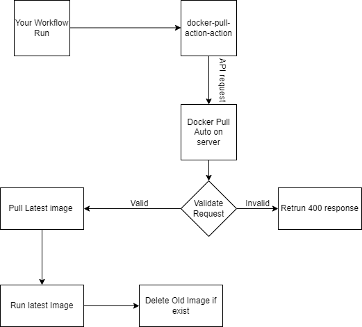

# Docker Pull Auto

This project developed on [Nest](https://github.com/nestjs/nest) framework. Idea of this project is to pull docker images automatically on server whenever there is push. Github webhook calls docker pull auto api whenever workflow runs on github.
You add a config.json file for your docker containers which need to pull auto. Whenever receives request on api, api compares with config file and gets app. App contains information about repository and docker image. API uses this information to pull latest image from docker, runs this pulled image and also delete old image if exist.

## High level diagram

[Check documentation here](https://codebysandip.github.io/docker-pull-auto)
