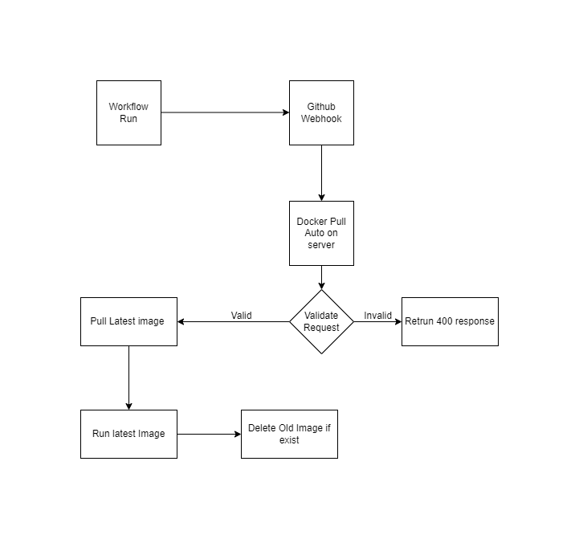

# Docker Pull Auto

This project developed on [Nest](https://github.com/nestjs/nest) framework. Idea of this project is to pull docker images automatically on server whenever there is push. [Docker pull auto action](https://github.com/marketplace/actions/docker-pull-auto-action) calls docker pull auto api whenever workflow runs on github.
You add a config.json file for your docker containers which need to pull automatically. Whenever docker pull auto webhook api receives request, api compares with config file and gets app. App contains information about docker image. API uses this information to pull image from docker, runs this pulled image and also delete old images if exist.

Configuration of Docker pull auto takes maximum of 2 hr to automate your docker images. Docker pull auto have following features:

- Automatically pull docker images from docker registry whenever [docker pull auto action](https://github.com/marketplace/actions/docker-pull-auto-action) sends request
- Delete older images, if exist
- Supports multiple docker images to run on server
- You can use postman also to deploy new images on server
- Security: Docker pull auto uses SHA256 to validate request is coming from docker pull auto action or valid request
- Example workflow file to deploy docker pull auto on your server, so you don't need to worry about deployment of docker pull auto
- Supports reading of encrypted (config.enc.json) config.json
- Support multiple config json based on environment. It means you can have config.development.json and config.staging.json
- Supports docker env and docker env file when enables passing environment variables to docker
- Supports running a command before docker run, Which enables to have encrypted environment file

## High level diagram

## Useful Links

- #### [Getting Started](./getting-started.md)

- #### [How to add docker container app for auto pull in config json](./how-to-add-docker-container-app.md)

- #### [What is HOOK_SECRET and How to create HOOK_SECRET](./how-to-create-hook-secret.md)
- #### [How to create multiple config based on environment](./how-to-create-multiple-config-based-on-env.md)
- #### [How to encrypt config.json](./how-to-encrypt-config-json.md)
- #### [How to add environment file for Docker App/ Config App](./how-to-add-environment-file-for-config-app.md)
